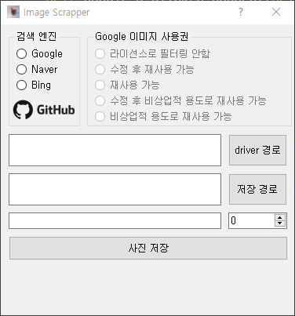

# image_scrapper

# How to use
1. 원하는 검색 엔진을 선택 합니다.
   - Naver와 Bing은 저작권 선택하는 항목이 없으므로 사용 시 주의하시기 바랍니다.
2. (1에서 Google을 선택했을 경우 이미지 사용권을 선택 합니다.)
3. 현재 Chrome Browser에서만 동작하므로 사용 시 Chrome Driver가 필요합니다.  
   Chrome Browser의 설정에서 사용중인 버전을 확인하신 후 [여기](https://chromedriver.chromium.org/downloads)에서 Chrome Driver를 다운로드합니다.
4. `driver 경로` 버튼을 클릭해서 3에서 저장한 Chrome Driver의 위치를 지정합니다.
5. `저장 경로` 버튼을 클릭해서 이미지를 저장할 폴더를 지정합니다.
6. 검색어와 원하는 이미지의 갯수를 설정합니다.
7. `사진 저장` 버튼을 클릭해서 프로그램을 시작합니다.

 

현재 Google만 사용 가능합니다.

# Skills
- Python3
- PyQt5

# Release  
|Version|Date|Comments|
|---|---|---|
|1.0.0|2020-06-06|최초 제작|
|1.1.0|2020-06-06|Progress Bar를 Real Time Count로 변경|

 

---
  
 

#### 문의사항은 [Issue](https://github.com/IllIIIllll/image_scrapper/issues) 페이지에 남겨주세요.
